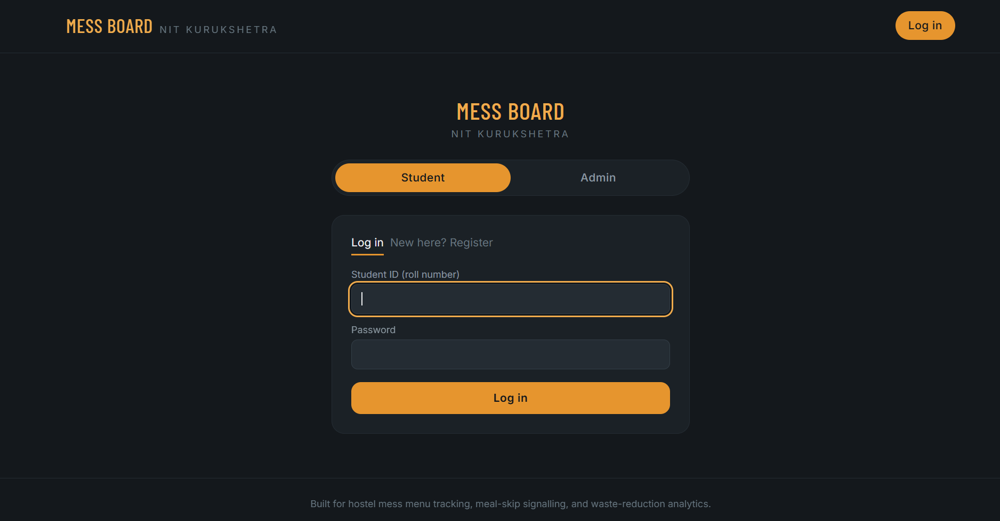
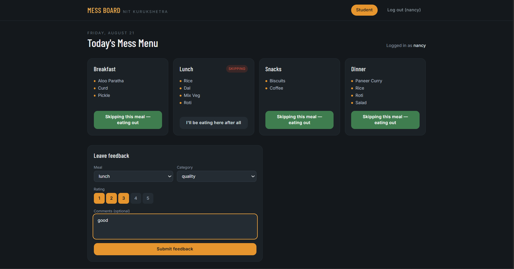
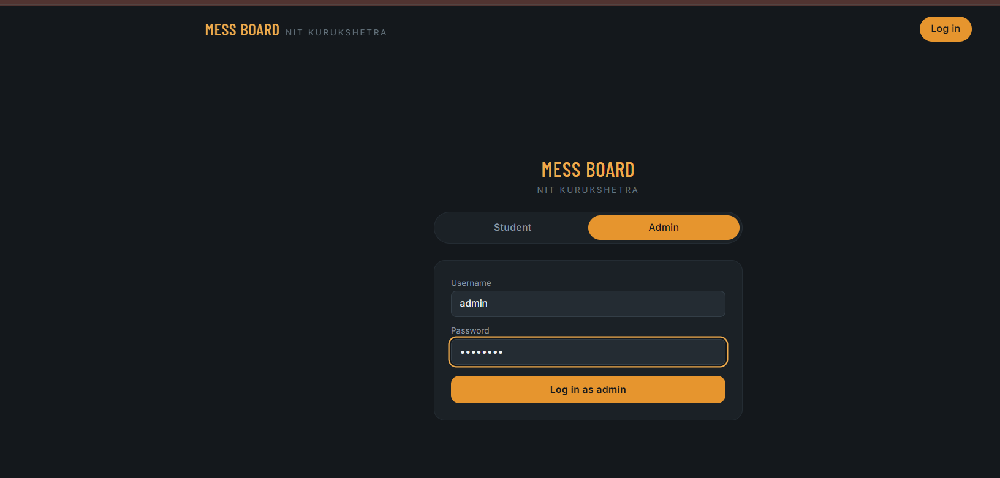
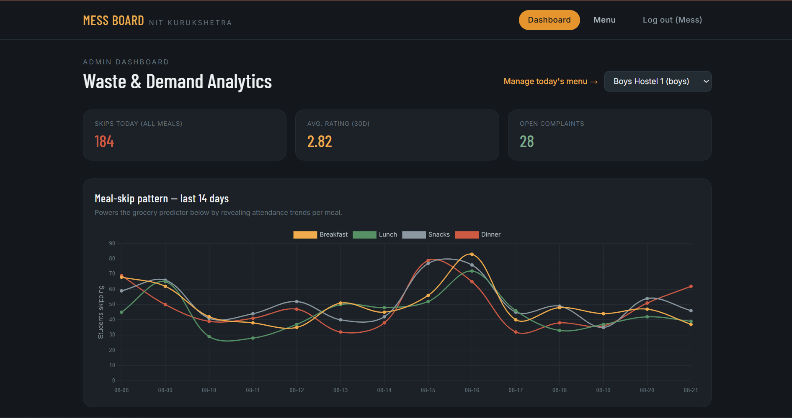
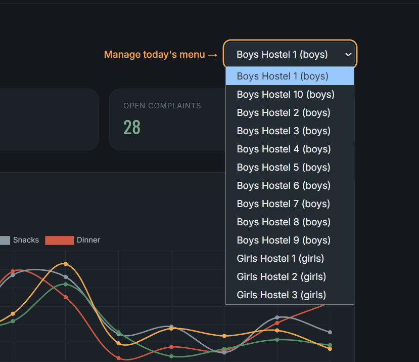
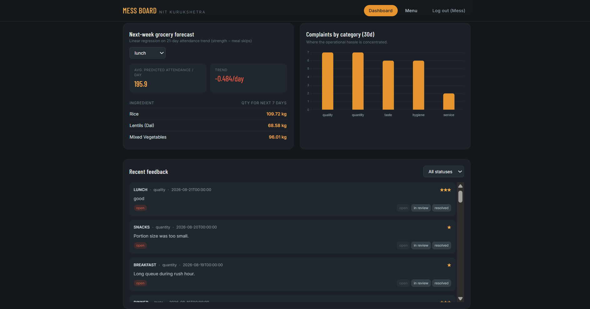
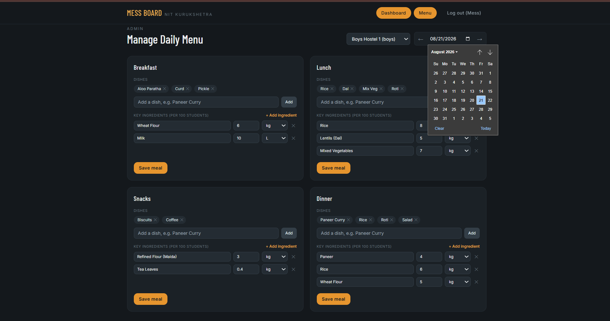

# Mess Board — Hostel Mess Waste Management & Review Analytics

Built for NIT Kurukshetra's 10 boys' hostels + 3 girls' hostels. Students see the
dynamic daily menu and toggle **"Skipping Next Meal"** if they're eating out;
mess admins get a dashboard of skip patterns, complaint analytics, and a
linear-regression forecast of next week's grocery needs.

## Stack

- **Frontend:** React (Vite) + Tailwind CSS + Chart.js
- **Backend:** Python **FastAPI** + MongoDB (via Motor, async driver)
- **Auth:** JWT-based login. Students log in with their **student ID (roll
  number) + password**; admins log in with a separate username/password.
  Passwords are hashed with bcrypt (`passlib`), tokens are signed HS256 JWTs
  (`python-jose`) valid 24h by default.
- **AI/Advanced feature:** scikit-learn `LinearRegression` fitted on 21 days of
  attendance (hostel strength − meal skips) to project the next 7 days, then
  multiplied by each menu's key-ingredient usage rate to forecast grocery
  quantities — no separate microservice needed, it's a route inside the same
  FastAPI app (`/api/analytics/predict-grocery`).

## Screenshots









## Project layout

```
hostel-mess-manager/
├── backend/                  FastAPI app
│   ├── app/
│   │   ├── main.py           app entrypoint, CORS, router registration
│   │   ├── config.py         env-based settings
│   │   ├── database.py       Motor client + collections + indexes
│   │   ├── utils.py          ObjectId helpers / serializers
│   │   ├── models/schemas.py Pydantic request/response models
│   │   ├── security.py       password hashing + JWT create/decode
│   │   ├── deps.py           get_current_user / require_student / require_admin
│   │   └── routers/
│   │       ├── auth.py       student register/login, admin login, /me
│   │       ├── hostels.py    hostel + student CRUD (admin-only writes)
│   │       ├── menu.py       daily dynamic menu (admin-only writes)
│   │       ├── skips.py      "skipping next meal" toggle (student, own record only)
│   │       ├── complaints.py review/complaint CRUD (student creates, admin resolves)
│   │       └── analytics.py  skip-summary, complaint-summary, grocery predictor
│   ├── seed.py                populates demo hostels/students/menus/history
│   ├── requirements.txt
│   └── .env.example
└── frontend/                 React + Vite app
│   ├── src/
│   │   ├── App.jsx            nav + routing (Student / Admin, auth-aware)
│   │   ├── api.js              fetch client for the FastAPI backend + bearer token
│   │   ├── context/
│   │   │   └── AuthContext.jsx    login state, token persistence (localStorage)
│   │   └── components/
│   │       ├── LoginPage.jsx          student login/register + admin login tabs
│   │       ├── ProtectedRoute.jsx     redirects to /login if not authed / wrong role
│   │       ├── MenuManager.jsx        admin: create/edit daily menu per hostel + date
│   │       ├── MenuEditCard.jsx       per-meal dish list + ingredient editor
│   │       ├── IngredientEditor.jsx   editable key-ingredient rows (feeds the forecast)
│   │       ├── StudentView.jsx        today's menu + skip toggles + feedback form
│   │       ├── AdminDashboard.jsx     charts + forecast + complaints inbox
│   │       ├── MealCard.jsx
│   │       ├── ComplaintForm.jsx
│   │       ├── ComplaintsList.jsx
│   │       ├── SkipTrendChart.jsx     Chart.js line chart
│   │       ├── ComplaintCategoryChart.jsx  Chart.js bar chart
│   │       ├── GroceryForecastPanel.jsx
│   │       └── HostelSelect.jsx
│   └── ...vite/tailwind config
```

## Running it locally

### 1. MongoDB

You need a MongoDB instance reachable at the URI in `backend/.env`. Easiest
options:

```bash
# via Docker
docker run -d -p 27017:27017 --name mess-mongo mongo:7

# or install MongoDB Community Server locally and run `mongod`
```

### 2. Backend (FastAPI)

```bash
cd backend
python -m venv venv && source venv/bin/activate   # Windows: venv\Scripts\activate
pip install -r requirements.txt
cp .env.example .env                                # adjust MONGO_URI if needed

# populate demo data (10 boys + 3 girls hostels, one fully seeded with
# ~21 days of realistic skip/complaint history)
python seed.py

uvicorn app.main:app --reload --port 8000
```

API docs (Swagger UI) will be live at `http://localhost:8000/docs`.

### 3. Frontend (React)

```bash
cd frontend
npm install
npm run dev
```

Open `http://localhost:5173`. It talks to the API at `http://localhost:8000`
by default — override with a `VITE_API_URL` env var if you deploy the backend
elsewhere.

## Logging in

The app now requires login. `seed.py` prints working demo credentials at the
end of its run, but for reference:

| Role    | Identifier                                  | Password      |
|---------|----------------------------------------------|---------------|
| Admin   | `admin`                                       | `admin123`    |
| Student | any seeded roll number, e.g. `NITK-<hostelId>-0001` | `student123`  |

A brand-new student can also just click **"New here? Register"** on the login
screen — pick a hostel, set a roll number + password, and you're in.

Under the hood: `POST /api/auth/student/login` and `/api/auth/admin/login`
verify a bcrypt-hashed password and return a signed JWT (24h expiry). The
frontend stores it in `localStorage` and attaches it as
`Authorization: Bearer <token>` on every request via `api.js`. On the backend,
`app/deps.py` decodes and validates that token per-request:

- `require_student` — used by the skip-toggle and complaint-creation routes;
  also checks the `studentId` in the request body matches the token's
  subject, so a student can never toggle or complain as someone else.
- `require_admin` — used by menu creation and complaint status updates.

<<<<<<< HEAD
Try it yourself: log in as a student and call `POST /api/menu` from
`/docs` with that token — you'll get a `403 Admin account required`.

## Core flows

- **Login (`/login`):** student tab (login or register) and admin tab, each
  with its own form and error handling.
- **Student view (`/`):** shows the day's published menu per meal for your
  own hostel, and lets you toggle "Skipping this meal" if you're eating out.
  Skips are upserted per student/date/meal, so toggling is idempotent. A short
  feedback form lets you rate and comment on any meal.
- **Admin dashboard (`/admin`):** a 14-day Chart.js line chart of skip counts
  per meal type, a 30-day complaint-category bar chart, an average-rating /
  open-complaints summary, a complaints inbox with a 3-stage status workflow
  (open → in review → resolved), and the **grocery forecast panel** — pick a
  meal type and it regresses the last 21 days of attendance, projects 7 days
  forward, and multiplies by each ingredient's per-100-student usage rate
  (defined per menu entry) to tell the mess how much rice, dal, paneer, etc.
  to buy for the coming week.
- **Menu manager (`/admin/menu`):** pick a hostel and date (with ← → day
  navigation), and edit each of the four meals independently — add/remove
  dishes as chips, and add/remove key-ingredient rows (name, quantity per 100
  students, unit). "Save meal" calls the same `POST /api/menu` upsert the seed
  script uses, so changes show up immediately in the student view and feed
  straight into the grocery forecast.

## Extending it

- `Menu.keyIngredients` is where you encode a dish's per-100-student usage
  rate (e.g. rice: 8 kg / 100 students) — add more entries per menu to widen
  the grocery forecast.
- Swap `LinearRegression` for a more sophisticated model (e.g. a small
  seasonal model or gradient boosting) in `analytics.py` without touching any
  other layer — the route contract stays the same.
- There's a full admin menu-management UI (`/admin/menu`) now — see "Core
  flows" below. `Menu.keyIngredients` entered there is exactly what feeds the
  grocery forecast.
=======
>>>>>>> 4144e8d4ebc139d38765b476025dd0132b41baca
