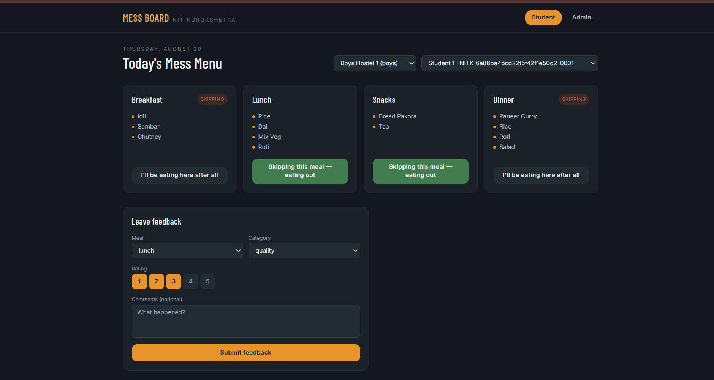
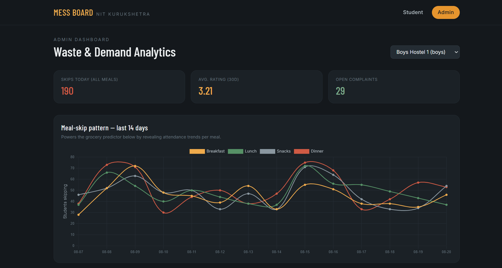
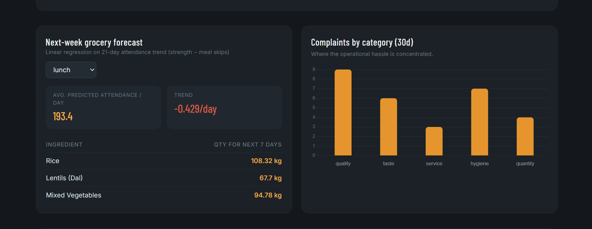
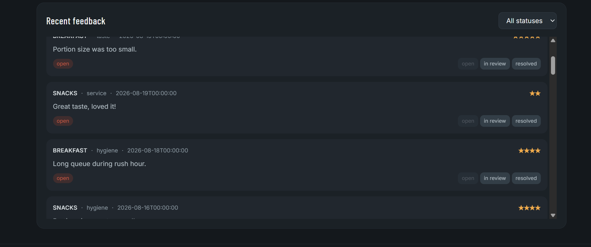

# 🍽️ Mess Board — NIT Kurukshetra Hostel Mess Manager

A full-stack web app for managing hostel mess menus, meal skips, student feedback, and mess analytics across hostels at NIT Kurukshetra.

## Features

- **Daily mess menu** — View breakfast, lunch, snacks, and dinner for the selected hostel and date
- **Meal skip tracking** — Students can mark a meal as "skipping — eating out" so the mess knows headcount in advance
- **Hostel & student selection** — Switch between hostels and students to view/manage their meal preferences
- **Feedback & complaints** — Students can leave feedback on meals (category + rating) and file complaints
- **Admin dashboard** — Publish/update menus, review complaints, and view analytics
- **Analytics** — Skip-rate summaries, complaint summaries, and grocery demand prediction based on historical data

## Screenshots






## How It Works

1. **Pick a hostel** — On load, the app fetches the list of hostels from `/api/hostels` and auto-selects the first one. You can switch hostels anytime from the dropdown at the top.
2. **Pick a student** — Once a hostel is selected, the student dropdown populates with that hostel's students (`/api/hostels/{id}/students`). This identifies who's viewing/skipping meals.
3. **View today's menu** — For the selected hostel and today's date, the app calls `/api/menu?hostelId=...&date=...` and renders Breakfast, Lunch, Snacks, and Dinner as cards with their published items.
4. **Skip a meal** — Each meal card has a "Skipping this meal — eating out" toggle. Toggling it calls `/api/skips` to record that the student won't be eating that meal, so the mess can adjust quantities. The UI updates optimistically and reverts if the request fails.
5. **Leave feedback** — The feedback form lets a student rate a specific meal and category (e.g. quality, quantity, hygiene) and submits it via `/api/complaints`.
6. **Admin side** — Switching to the "Admin" tab lets mess staff publish/update the day's menu, review student complaints, update complaint status, and view analytics like skip rates and predicted grocery needs — all pulled from the `/api/analytics/*` endpoints.

**Note on IDs:** MongoDB documents return `_id` as the identifier field. Make sure any frontend code referencing hostel/student objects uses `_id` (not `id`) consistently, or map `_id` → `id` in the backend response — a mismatch here will silently break menu/skip/analytics calls (the UI will look fine but no data loads).

## Tech Stack

**Backend**
- FastAPI (Python)
- MongoDB
- Uvicorn (ASGI server)

**Frontend**
- React + Vite
- Tailwind CSS
- react-router-dom

## Project Structure

```
hostel-mess-manager/
├── backend/
│   ├── app/
│   │   ├── models/       # Pydantic / DB models
│   │   ├── routers/      # API route handlers
│   │   ├── config.py
│   │   ├── database.py
│   │   ├── main.py       # FastAPI app entrypoint
│   │   └── utils.py
│   ├── seed.py           # Seed script for sample hostels/students/menu data
│   ├── requirements.txt
│   └── .env.example
└── frontend/
    ├── src/
    │   ├── components/    # HostelSelect, StudentSelect, MealCard, ComplaintForm, etc.
    │   ├── api.js          # API client wrapper
    │   └── App.jsx
    ├── index.html
    ├── package.json
    ├── tailwind.config.js
    └── vite.config.js
```

## Getting Started

### Prerequisites
- Python 3.10+
- Node.js 18+
- MongoDB instance (local or hosted, e.g. MongoDB Atlas)

### Backend Setup

```bash
cd backend
python -m venv venv
source venv/bin/activate      # Windows: venv\Scripts\activate
pip install -r requirements.txt
cp .env.example .env          # then fill in your MongoDB connection string, etc.
python seed.py                # populates sample hostels, students, and menu data
uvicorn app.main:app --reload --port 8000
```

The API will be available at `http://localhost:8000`, with interactive docs at `http://localhost:8000/docs`.

### Frontend Setup

```bash
cd frontend
npm install
npm run dev
```

The app will be available at `http://localhost:5173`.

> By default the frontend expects the API at `http://localhost:8000`. To point elsewhere, set `VITE_API_URL` in a `.env` file inside `frontend/`.

## API Overview

| Resource | Endpoints |
|---|---|
| Hostels | `GET/POST /api/hostels`, `GET/POST /api/hostels/{id}/students` |
| Menu | `GET/POST /api/menu`, `GET /api/menu/range` |
| Skips | `GET/POST /api/skips` |
| Complaints | `GET/POST /api/complaints`, `PATCH /api/complaints/{id}/status` |
| Analytics | `GET /api/analytics/skip-summary`, `GET /api/analytics/complaint-summary`, `GET /api/analytics/predict-grocery` |

Full request/response schemas are available via the auto-generated Swagger docs at `/docs`.

## Roadmap / Ideas

- [ ] Authentication for students/admins
- [ ] Push notifications for menu updates
- [ ] Mobile-responsive polish
- [ ] Export analytics as CSV/PDF

